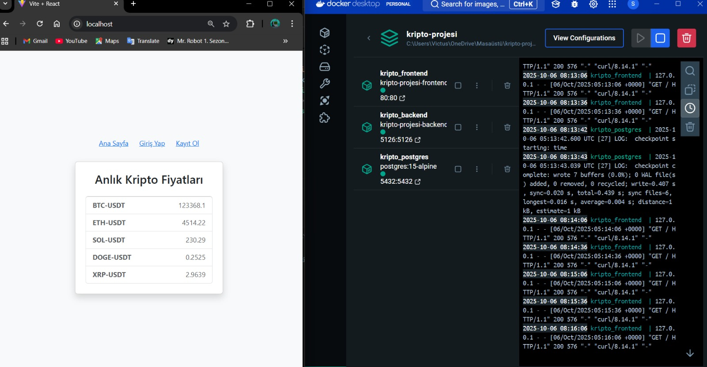
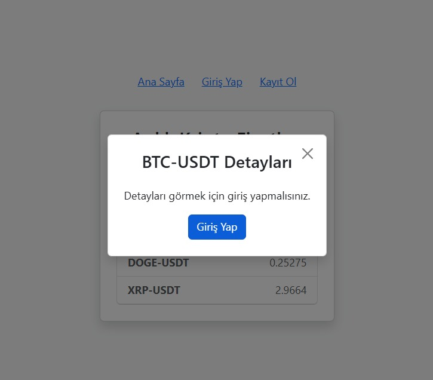
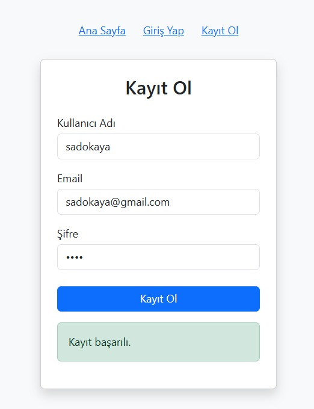
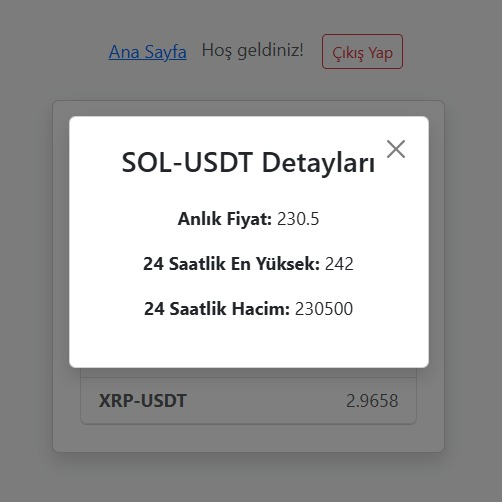

# Kripto Projesi 🚀

## 📖 Proje Açıklaması  
Bu proje, **bir kripto para borsası web uygulaması**dır.  

- **Giriş yapmamış kullanıcılar**, sadece ürünlere ait **anlık fiyat bilgilerini** görebilir.  
- Detay görmek isteyen kullanıcılar, **giriş ekranına yönlendirilir**.  
- **Kayıtlı kullanıcılar giriş yaptıktan sonra**, kripto paraların detay bilgilerini (anlık fiyat, 24 saatlik en yüksek değer, 24 saatlik hacim) görüntüleyebilir.  

Uygulama **Docker üzerinde container’lar ile ayağa kaldırılmaktadır**.  

---

## 🖼️ Ekran Görüntüleri  

### 🔹 Docker üzerinde uygulamanın ayağa kaldırılması


### 🔹 Giriş yapmamış kullanıcının coin detaylarını görememesi


### 🔹 Kayıt Ol ekranı


### 🔹 Kayıt olup giriş yapan kullanıcının coin detaylarını görüntüleyebilmesi


---

## 🛠️ Kullanılan Teknolojiler  
- **.NET Core 6+** (Backend API)  
- **React 18 (Vite.js)** (Frontend)  
- **Docker** (Containerization)  
- **PostgreSQL** (Veritabanı)  
- **Git & GitHub** (Versiyon kontrolü)  
- **JWT Token** (Authentication)  
- **WebSocket** (Gerçek zamanlı fiyat güncellemeleri)  
- **OKX Kripto Borsası Public API** (Veri kaynağı)  

---

## ⚙️ Özellikler  
- Docker Compose ile **backend, frontend ve veritabanı container’ları** kolayca ayağa kaldırma  
- **JWT tabanlı kimlik doğrulama**  
- **WebSocket** ile canlı fiyat akışı  
- OKX API’den anlık kripto fiyatları ve detayları çekme  
- **Kullanıcı girişi olmadan fiyat bilgisi**, giriş sonrası detay bilgisi görüntüleme  

---

## 🚀 Çalıştırma  
Proje dizininde:  
```bash
docker-compose up -d --build
